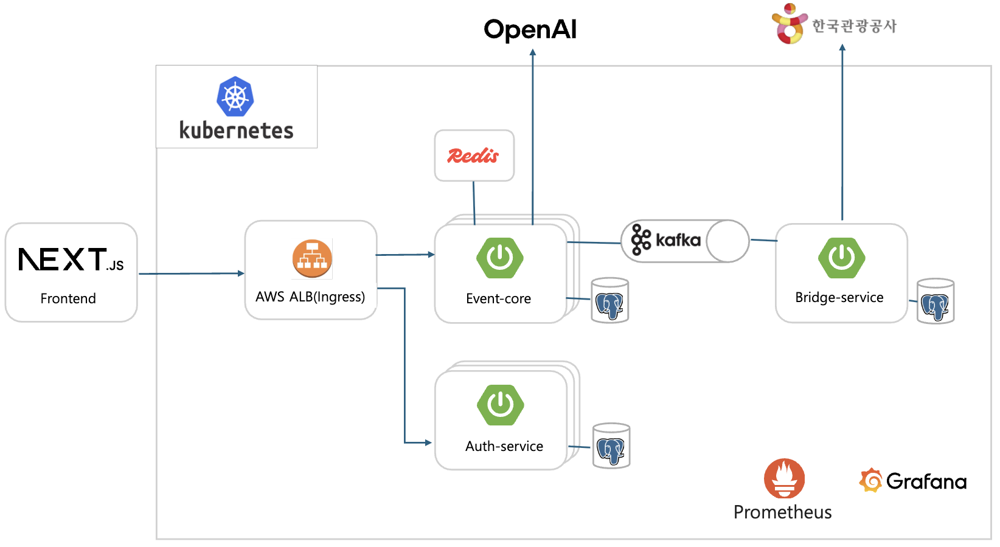
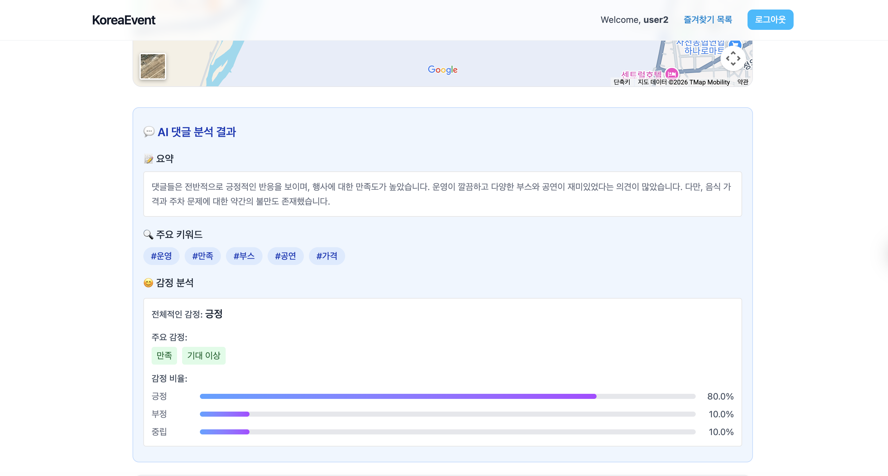
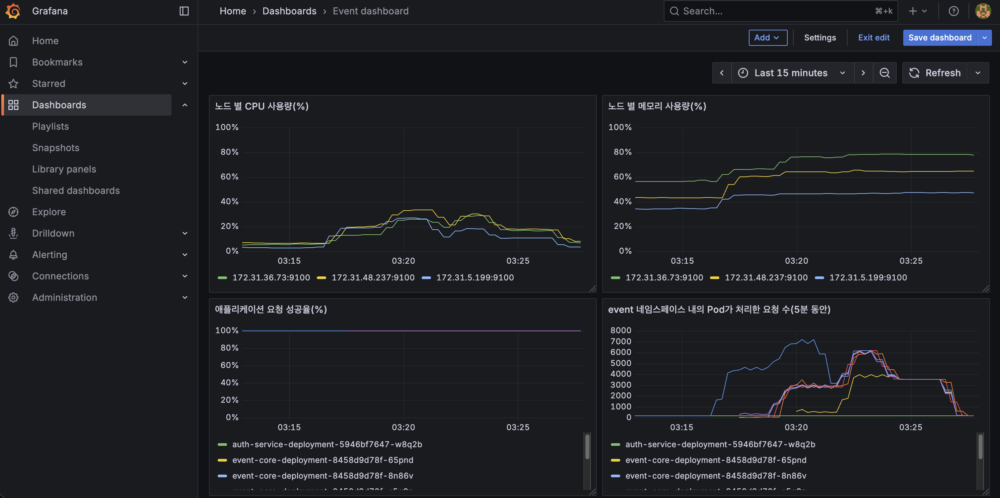
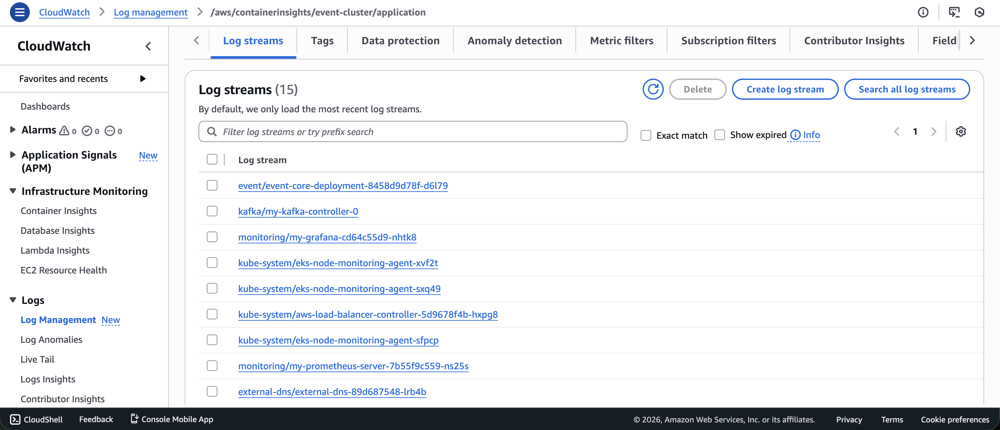

> 개인 포트폴리오 프로젝트입니다.

# Korea Event (korea-event)

이벤트 데이터의 **수집–적재**를 분리해 안정적으로 운영하고, 사용자에게는 **이벤트 탐색·댓글·즐겨찾기** 경험을 제공합니다. 또한 댓글을 **AI로 요약·분석**해 인사이트를 빠르게 전달합니다.

**MSA** 로 분리·운영하여 각 도메인을 독립적으로 확장·관리합니다.

백엔드는 **Amazon Elastic Kubernetes Service(Spring Boot 3.5)** 환경에서 운영하고, 프론트엔드는 **Vercel(React 19, Next.js 15)** 에서 서비스합니다.

---

## Table of Contents

- [시스템 아키텍처 및 URL](#시스템-아키텍처-및-url)
- [이미지](#이미지)
- [해결하려던 문제](#해결하려던-문제)
- [해결 방식](#해결-방식)
- [주요 기능](#주요-기능)
- [기술 스택](#기술-스택)
- [프런트엔드 구성](#프런트엔드-구성)
- [백엔드 구성](#백엔드-구성)
- [인프라 구성](#인프라-구성)
- [License](#license)

---

## 시스템 아키텍처 및 URL

**URL** : [https://www.koreaevent.click](https://www.koreaevent.click)

---

## 이미지

---

## 해결하려던 문제

- **[1] 탐색 비용**: 여러 사이트에 흩어진 행사 정보를 일일이 찾아보며 갈 만한 행사를 고르기 어렵습니다.
- **[2] 의견 파악 비용**: 후기가 많아질수록 분위기나 핵심 포인트를 짧은 시간에 파악하기 어렵습니다.
- **[3] 정보의 최신성/일관성**: 행사 정보가 늦게 업데이트되거나 누락되면 사용자는 오래된 정보로 계획을 세우게 됩니다.
- **[4] 서비스 신뢰성**: 특정 외부 정보원이 불안정해도 서비스 전체가 느려지거나 멈추지 않아야 합니다.
- **[5] 계정/행동의 안전**: 로그인·댓글·즐겨찾기 같은 기능에서 내 계정이 안전하게 보호되고, 권한 없는 요청이 막혀야 합니다.
- **[6] 로그인 유지 + 사용자 증가 대응**: 사용자가 늘어도 로그인 상태가 안정적으로 유지되어 토큰 만료·갱신으로 이용 흐름이 끊기지 않아야 합니다.
- **[7] 트래픽 급증 대응**: 특정 시즌/시간대에 이용자가 몰려도 서비스가 느려지지 않아야 합니다.
- **[8] 장애 대응 속도**: 문제가 생겼을 때 원인을 빠르게 파악해 복구해야 합니다.

---

## 해결 방식

- **[1] 탐색 기능 제공**: 한국관광공사 TourAPI 기반 이벤트를 한 곳에 모아 제공하고, 매일(01:00) 데이터를 갱신해 최신성을 유지합니다. 또한 검색/지역 필터/정렬/페이지네이션으로 빠른 탐색을 지원합니다.
- **[2] AI 의견 요약**: Spring AI(OpenAI)로 댓글을 요약/키워드/분위기 관점에서 분석하고, 결과는 Redis 캐시로 재조회 비용을 줄입니다.
- **[3] 배치 처리 표준화**: Spring Batch로 수집 작업을 스텝(Step) 단위로 구성해 재시도/재실행과 실행 이력 관리를 가능하게 합니다.
- **[4] 비동기 파이프라인(완충/격리)**: Kafka로 수집과 적재를 분리해 부하를 완충하고 장애 전파를 격리합니다.
- **[5] 보안 계층 표준화**: Spring Security로 인가 규칙/필터 체인/인증 실패 처리 방식을 표준화해 구현 편차와 보안 실수를 줄입니다.
- **[6] 무상태 인증 + 세션 UX**: JWT 기반 무상태 인증으로 서버 세션 의존을 없애 수평 스케일링 부담을 줄이고, Refresh 토큰 기반 갱신 흐름으로 로그인 상태를 자연스럽게 유지합니다.
- **[7] 오토 스케일링 구성**: AWS EKS에서 AWS Application Load Balancer(Ingress)와 HPA로 트래픽에 따라 자동으로 스케일링되도록 구성합니다.
- **[8] 관측성 구성**: Prometheus/Grafana와 Fluent Bit → AWS CloudWatch로 메트릭/로그 기반 관측성을 확보합니다.

---

## 주요 기능

### 프런트엔드 기능

- **이벤트 탐색**: 목록/검색/지역 필터 기반 이벤트 탐색 및 상세 페이지 제공
- **댓글**: 이벤트별 댓글 작성/수정/삭제 및 무한 스크롤 기반 조회
- **즐겨찾기**: 이벤트 즐겨찾기 추가/해제 및 즐겨찾기 목록 조회
- **AI 최신 댓글 분석**: 댓글이 일정 개수 이상일 때 요약/키워드/감정 분석 제공
- **인증 UX**: 로그인/회원가입, 토큰 갱신(Refresh) 및 세션 쿠키 관리
- **반응형 UI**: UI 사이즈에 따라 레이아웃이 자연스럽게 변경되도록 구성

### 백엔드 기능

- **`auth-service`**: 회원가입, 로그인, 토큰 갱신(JWT)
- **`event-core`**: 이벤트 조회, 댓글 CRUD, 즐겨찾기, AI 댓글 분석(Spring AI) 및 Redis 캐싱, Kafka 소비/DB 적재
- **`bridge-service`**: 공공데이터 API 기반 이벤트 수집 배치(Spring Batch) + Kafka 발행

---

## 기술 스택

### 프런트엔드

- **Framework**: React 19, Next.js 15(App Router)
- **UI**: Tailwind CSS, Radix UI, lucide-react
- **Data Fetching**: fetch, SWR(무한 스크롤), Server Actions
- **Validation**: zod
- **Auth UX**: 토큰 기반 인증 흐름 + Refresh 라우트로 세션 갱신

### 백엔드

- **Language/Framework**: Java, Spring Boot 3.5
- **Security**: Spring Security, JWT
- **Data**: Spring Data JPA, PostgreSQL
- **비동기/데이터 파이프라인**: Kafka
- **Batch**: Spring Batch
- **Caching**: Redis
- **AI**: Spring AI(OpenAI)
- **Ops**: Spring Boot Actuator, OpenAPI/Swagger

### 인프라

- **Kubernetes**: AWS EKS
- **Database**: AWS RDS (PostgreSQL)
- **Cache**: Redis
- **Message queue**: Kafka
- **Container registry**: AWS ECR
- **Ingress**: AWS ALB Ingress Controller
- **Auto scaling**: HPA
- **Logging**: Fluent Bit DaemonSet → AWS CloudWatch Logs
- **Metrics**: Prometheus + Grafana

---

## 프런트엔드 구성

### `frontend` (Next.js / Vercel)

- **역할**: 사용자 UI 제공(이벤트 탐색/댓글/즐겨찾기/AI 분석 결과 확인)
- **배포/운영**: Vercel에서 운영(React 19, Next.js 15 App Router)
- **데이터 패칭**
  - 목록/상세: `fetch` 기반 호출
  - 댓글: SWR Infinite + 커서 기반 페이지네이션 + `IntersectionObserver`로 무한 스크롤 구현
  - 작성/수정/삭제: Server Actions로 처리 후 SWR `mutate`로 캐시를 부분 갱신(`revalidate: false`)
- **인증 UX**
  - 토큰은 HttpOnly 쿠키로 관리
  - 액세스 토큰 만료 시 Refresh 토큰 기반 갱신 흐름으로 로그인 상태 유지
- **UI 특성**: 반응형 레이아웃

#### 무한 스크롤 및 캐싱 상세 (SWR)

- **커서 기반 페이지네이션**: `nextCursor`가 `null`이 될 때까지 다음 페이지를 요청하며, 요청 키는 `createCommentListGetKey`에서 `/${contentId}/comments?cursor=...` 형태로 생성합니다.
- **무한 스크롤 트리거**: `IntersectionObserver`로 하단 타겟을 감지해 다음 페이지를 로드하며, `rootMargin`을 크게 잡아(프리패치) 체감 로딩을 줄입니다.
- **SWR Infinite 캐시 정책**: 중복 요청을 줄이기 위해 `dedupingInterval`을 사용하고, 포커스/마운트 시 과도한 재검증을 막기 위해 `revalidateOnFocus`, `revalidateOnMount` 등을 조정했습니다.
- **부분 갱신(mutate)**: SWR 캐시(=현재 화면에 보여줄 “댓글 목록 상태”)를 `mutate`로 **직접 업데이트**해, 댓글 작성/수정/삭제 결과가 즉시 UI에 반영되도록 했습니다.
  - **상세 동작**
    - **작성(`comment-insert-form.tsx`)**: 첫 페이지(인덱스 0)의 `commentResponseList` 맨 앞에 새 댓글을 추가합니다. (만약 캐시가 비어 있으면 1페이지짜리 배열을 새로 만들어 반환)
    - **삭제(`comment-delete-form.tsx`)**: 모든 페이지의 `commentResponseList`에서 삭제할 `commentId`를 `filter`로 제거합니다.
    - **수정(`comment-update-form.tsx`)**: 모든 페이지에서 수정된 댓글의 `commentId`를 먼저 제거한 뒤, 첫 페이지 맨 앞에 수정된 댓글을 다시 추가합니다.
  - **`revalidate: false`**: `mutate` 후에 댓글 목록을 **다시 GET으로 재요청(재검증)** 하지 않고, 방금 업데이트한 캐시를 그대로 사용해 불필요한 트래픽을 줄입니다.

---

## 백엔드 구성

### `event-core` (이벤트 도메인 + AI)

- **이벤트 API**: `/events/{version}` 기반으로 목록/상세/즐겨찾기 제공
- **댓글 API**: `/events/{version}/{contentId}/comments` 기반 CRUD, 조회는 **무한 스크롤 방식**
- **Kafka 소비**: `bridge-service`가 발행한 이벤트 메시지를 소비 → **DB upsert**
- **AI 댓글 분석**: Spring AI(OpenAI)로 요약/키워드/감정 분석 → **Redis 캐시로 성능 최적화**
- **AWS EKS 라우팅**: **Ingress** 에서 `/events`, `/ai` 경로로 라우팅

#### AI 댓글 분석 상세 (Spring AI)

- **분석 조건**: 댓글이 일정 개수 이상일 때만 분석을 수행합니다. (설정: `size.required-ai-comment`)
- **분석 대상 데이터**: 최신 댓글 중 최대 N개만 사용해 분석합니다. (설정: `size.ai-comment`)
- **요청/응답 흐름**:
  - `event-core`가 Spring AI `ChatClient`로 OpenAI에 분석을 요청하고, 응답 텍스트를 JSON으로 파싱해 반환합니다.
  - 응답이 마크다운 코드블록 형태(예: `json ... `)로 오더라도 순수 JSON만 추출해 파싱합니다.
- **응답 포맷(개요)**: 요약(`summary`), 핵심 키워드 배열(`keywords`), 감정 분석(`emotion.overall`, `emotion.ratio`, `emotion.mainEmotions`)
- **캐시**: 동일 `contentId` 요청은 Spring Cache `@Cacheable(value="comment-analysis", key=contentId)`로 캐시해 성능과 비용을 최적화합니다.

### `auth-service` (인증)

- **책임**: 회원가입, 로그인, 액세스 토큰 갱신(Refresh Token 기반)
- **보안**: Spring Security + Stateless(JWT), Actuator/Swagger 등 필요한 엔드포인트만 공개
- **AWS EKS 라우팅**: Ingress에서 `/auth` 경로로 라우팅

#### 인증/인가 상세 (JWT + Refresh)

- **세션 저장 방식(Frontend)**: 토큰은 **HttpOnly 쿠키**로 관리합니다.
- **Access Token 전달 방식(Backend)**: 보호가 필요한 요청은 `Authorization: Bearer <access-token>` 헤더로 인증합니다.
- **Stateless**: 백엔드는 세션을 서버에 저장하지 않는 방식(STATELESS)으로 동작합니다.

##### 보호되는 API 범위

- **인증 서비스**
  - 공개(permitAll): 회원가입/로그인/토큰 갱신(Refresh), Swagger/OpenAPI, Actuator
  - 그 외 요청: 인증 필요
- **이벤트 도메인 API**
  - 인증 필요: 댓글 작성/수정/삭제, 즐겨찾기 추가/해제
  - 그 외 조회성 API: 공개(permitAll)

##### Refresh 토큰 기반 갱신 흐름

- 프론트는 요청 전에 `access-token` 쿠키를 확인하고, 없으면 `refresh-token`으로 토큰 갱신을 시도합니다.
- 갱신 요청은 인증 서비스의 Refresh API로 `x-refresh-token` 헤더를 포함해 전송합니다.
- 갱신 성공 시 `access-token`(및 `username`) 쿠키를 재발급하여 로그인 상태를 유지합니다.
- 로그아웃 시에는 토큰/사용자 쿠키를 만료시켜 세션을 종료합니다.

### `bridge-service` (배치/수집)

- **역할**: 공공데이터 API에서 이벤트 리스트/상세를 단계적으로 수집하고 **Kafka** 로 전송
- **실행 방식**: **CronJob**으로 주기 실행 (서버리스 배치 운영)
- **설계 포인트**: 실패 가능성이 있는 외부 호출을 서비스 API와 분리하여 안정성/확장성 확보

#### 배치 상세 (Spring Batch)

- **운영 스케줄**: Kubernetes CronJob으로 매일 `01:00`(Asia/Seoul) 실행 (`bridge-service-batch`)
- **Job 구성**: `eventFetchingAndSendingJob` (3개의 Step을 순차 실행, `RunIdIncrementer`로 실행 단위 구분)
  - **Step 1 - 목록 수집**: `areaBasedListFetchingStep`
    - 지역기반관광정보조회(AreaBasedList) API를 페이지(1부터) 단위로 반복 호출해 이벤트 목록을 수집합니다.
    - 수집 결과는 `JobExecutionContext`의 `eventDtoList`로 다음 스텝에 전달합니다.
  - **Step 2 - 상세 보강**: `detailFetchingStep`
    - Step 1에서 수집한 이벤트 목록을 기반으로 공통정보조회(DetailCommon) API 및 소개정보조회(DetailIntro) API를 호출해 상세 정보를 보강합니다.
  - **Step 3 - Kafka 전송**: `sendingToKafkaStep`
    - 완성된 이벤트 데이터를 Kafka 토픽(`event-topic`)으로 전송합니다.
- **재시도 정책**: 외부 API 호출/상세 조회/카프카 전송은 `RetryTemplate`로 재시도합니다.

---

## 인프라 구성

### Kubernetes (AWS EKS)

- **클러스터**: `event-core`, `auth-service`, `bridge-service`를 AWS EKS에서 운영합니다.
- **리소스 정의 위치**
  - 공용 매니페스트: `kubernetes/`
  - 서비스별 매니페스트: `event-core/kubernetes/`, `auth-service/kubernetes/`, `bridge-service/kubernetes/`
- **설정 주입**: 서비스별 `ConfigMap`/`Secret`로 런타임 설정을 분리합니다.

### Ingress (AWS ALB)

`kubernetes/ingress.yaml` 기준으로, 외부 트래픽은 **AWS ALB Ingress**를 통해 서비스로 라우팅됩니다.

- **호스트**: `api.koreaevent.click`
- **HTTPS**: ACM 인증서 + **HTTP(80) → HTTPS(443)** 리다이렉트
- **경로 기반 라우팅**
  - `/auth` → `auth-service-service:8080`
  - `/events` → `event-core-service:8080`
  - `/ai` → `event-core-service:8080`

### Auto Scaling

- **HPA**: `event-core`, `auth-service`는 HPA로 자동 스케일링합니다. (`*/kubernetes/hpa.yaml`)
  - **스케일 대상**: 각 서비스의 Deployment(`event-core-deployment`, `auth-service-deployment`)
  - **레플리카 범위**: `minReplicas=1`, `maxReplicas=6`
  - **스케일 기준(메트릭)**: CPU 평균 사용률(`averageUtilization`)이 **70%**를 기준으로 증감합니다. (`autoscaling/v2`, `Resource/cpu`, `Utilization`)
  - **증가 정책(scaleUp)**: 15초 단위로 **최대 4개 Pod까지** 빠르게 확장 가능 (`stabilizationWindowSeconds=15`, `Pods=4/15s`)
  - **감소 정책(scaleDown)**: 급격한 축소를 막기 위해 5분 안정화 후, 30초 단위로 **1개 Pod씩** 천천히 축소 (`stabilizationWindowSeconds=300`, `Pods=1/30s`)

### Batch 운영

- **CronJob**: `bridge-service`는 CronJob으로 배치를 실행합니다. (`bridge-service/kubernetes/cronjob.yaml`)

### Observability (로그/메트릭)

- **로그**: Fluent Bit DaemonSet으로 수집 → AWS CloudWatch Logs로 전송합니다. (`kubernetes/log/cloudwatch-namespace.yaml`, `kubernetes/log/fluent-bit-cluster-info.yaml`, `kubernetes/log/fluent-bit.yaml`)
- **메트릭**: Prometheus가 Actuator를 스크레이프하고, Grafana로 시각화합니다. (`kubernetes/prometheus/values.yaml`, `kubernetes/grafana/values.yaml`)

#### 로그 상세 (Fluent Bit → CloudWatch)

- **배포 형태**: `amazon-cloudwatch` 네임스페이스에 DaemonSet으로 배포되어, **모든 노드에 1개 Pod씩** 올라가 노드 레벨 로그를 수집합니다.
- **권한(보안)**: ServiceAccount에 **IRSA**(`eks.amazonaws.com/role-arn`)를 붙여 CloudWatch Logs 접근 권한을 부여합니다. Kubernetes 메타데이터 조회를 위해 `namespaces/pods` 읽기 RBAC도 포함됩니다.
- **수집 소스**: 노드의 `/var/log/containers/*.log`를 `tail`로 읽습니다(hostPath 마운트). 재시작 시 중복/유실을 줄이기 위해 오프셋 DB(`/var/fluent-bit/state/*.db`)를 사용합니다.
- **Log Group 구성**:
  - 애플리케이션: `/aws/containerinsights/${CLUSTER_NAME}/application`
  - 데이터플레인: `/aws/containerinsights/${CLUSTER_NAME}/dataplane`
  - 호스트: `/aws/containerinsights/${CLUSTER_NAME}/host`
- **Log Stream 네이밍 규칙**:
  - 애플리케이션 로그는 Lua 필터로 `cw_stream="<namespace>/<pod>"`를 만들고 `log_stream_template`로 **네임스페이스/파드 기준**으로 기록합니다.
  - 데이터플레인/호스트 로그는 시스템/노드 단위 특성상 `log_stream_prefix=${HOST_NAME}-`로 **노드 기준** 스트림을 유지합니다.
- **리전**: `ap-northeast-2`

### Data / Messaging

- **Database**: AWS RDS (PostgreSQL)
- **Cache**: Redis (`kubernetes/redis/values.yaml`)
- **Message Queue**: Kafka (`kubernetes/kafka/values.yaml`)
- **Container Registry**: AWS ECR

---

## License

Copyright (c) 2026 Styner-JEON  
All rights reserved.

### 한국어

본 저장소는 **기술 평가 목적**으로만 공개됩니다.  
소스 코드는 열람만 가능하며, 저작권자의 명시적 허가 없이  
사용, 복사, 수정, 배포, 상업적 이용은 금지됩니다.

### English

This repository is published for **technical evaluation purposes only**.  
The source code is viewable but may not be used, copied, modified,
or redistributed without explicit permission from the author.
